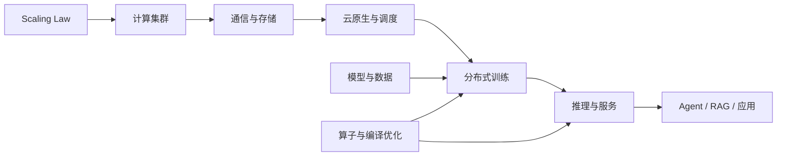

# AI Infra 体系总览

AI Infra 的主线不是“堆更多 GPU”，而是让模型、数据、计算、通信、存储和服务系统在同一个约束下协同。Scaling Law 决定资源投入方向，分布式系统决定训练上限，推理系统决定规模化成本，数据与应用则决定这些能力是否真正产生价值。

<SummaryHero
  :goals="['建立端到端系统地图', '识别各层核心瓶颈', '找到深入阅读入口']"
  duration="约 20 分钟"
  output="一张 AI Infra 学习路线"
>

本页把 Notion 中“00—07”八个模块压缩为四层视图，并把新增的 CUDA / Triton 算子经验接到推理与训练链路中。

</SummaryHero>

## 一条完整链路

## 四个核心判断

1. **资源扩展必须服从有效缩放。** Kaplan 规律强调模型规模，Chinchilla 进一步指出模型参数与训练数据需要更均衡地扩展；只增加参数并不等于获得最佳性能。
2. **大规模训练首先是系统问题。** SPTD、上下文并行、专家并行和 ZeRO 解决的是显存、通信与负载切分，而不是改变模型目标函数。
3. **推理优化必须同时看延迟、吞吐和显存。** KV Cache、PagedAttention、Continuous Batching、量化与模型压缩分别作用在不同瓶颈上，没有单一技术能覆盖所有工作负载。
4. **算子优化从瓶颈判断开始。** 在写 CUDA 或 Triton kernel 之前，先确定是 memory-bound、compute-bound 还是 launch-bound，再决定融合、分块或专用实现是否值得。

## 模块地图

| 层次 | 解决的问题 | 代表主题 | 深入阅读 |
| --- | --- | --- | --- |
| 资源层 | 算力如何稳定组成集群 | GPU/NPU、RDMA、集合通信、分布式存储 | [计算、通信与云原生](/ai-infra/compute-network) |
| 执行层 | 模型怎样高效训练与服务 | SPTD、ZeRO、Flash Attention、KV Cache | [训练与推理系统](/ai-infra/training-inference) |
| 模型层 | 训练什么、用什么数据 | Transformer、MoE、Mamba、多模态、数据工程 | [模型、数据与应用](/ai-infra/models-data-apps) |
| 内核层 | 单个热点路径怎样逼近硬件上限 | Profiling、HBM、Fusion、Triton | [算子工程方法](/ai-infra/operator-engineering) |

## 学习顺序

- 先理解计算、显存、网络带宽三个基本预算。
- 再学习并行策略与通信原语的映射关系。
- 接着对比训练与推理的负载差异。
- 最后进入算子、编译器和生产服务的细节。

## 来源

- [Notion：00 大模型系统概述](https://app.notion.com/p/33b3a54bd6b481c78d98eeba043ef51e)
- [Notion：AIInfra 文档总结索引](https://app.notion.com/p/AIInfra-33b3a54bd6b4816bb189e32d4f1ee54e)
- 原始课程：[AI Infra 文档](https://infrasys-ai.github.io/aiinfra-docs/)
